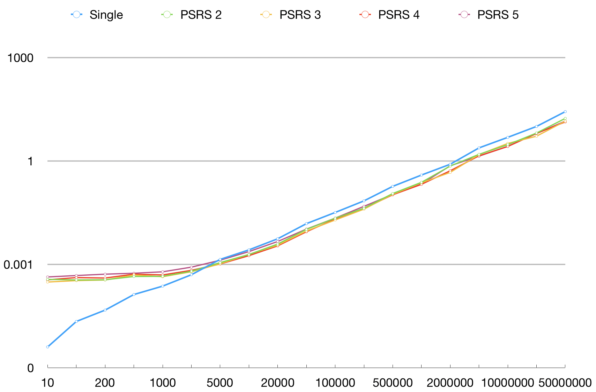

## PSRS 算法

#### 算法实现

本实验采用 C++ 实现 RSPS 算法，在 main.cpp 中的 `PSRS()` 函数。

#### 效率比较

实验测试随机生成大小为 [10, 100, 200, 500, 1000, 2000, 5000, 10000, 20000, 50000, 100000, 200000, 500000, 1000000, 2000000, 5000000, 10000000, 20000000, 50000000] 的数组，并用串行排序、PSRS 2-5 线程分别排序，同时获得算法的运行时间。

|              | **Single** | **PSRS 2** | **PSRS 3** | **PSRS 4** | **PSRS 5** |
| ------------ | ---------- | ---------- | ---------- | ---------- | ---------- |
| **10**       | 0.000004   | 0.000366   | 0.000306   | 0.000355   | 0.000430   |
| **100**      | 0.000022   | 0.000352   | 0.000337   | 0.000412   | 0.000473   |
| **200**      | 0.000047   | 0.000356   | 0.000351   | 0.000400   | 0.000518   |
| **500**      | 0.000133   | 0.000443   | 0.000492   | 0.000518   | 0.000551   |
| **1000**     | 0.000233   | 0.000449   | 0.000437   | 0.000492   | 0.000607   |
| **2000**     | 0.000499   | 0.000630   | 0.000610   | 0.000670   | 0.000828   |
| **5000**     | 0.001390   | 0.001122   | 0.001038   | 0.001021   | 0.001316   |
| **10000**    | 0.002624   | 0.001924   | 0.001945   | 0.001782   | 0.002341   |
| **20000**    | 0.005512   | 0.003874   | 0.003597   | 0.003424   | 0.004598   |
| **50000**    | 0.015159   | 0.010339   | 0.009272   | 0.008809   | 0.010531   |
| **100000**   | 0.032013   | 0.021833   | 0.019339   | 0.020620   | 0.021940   |
| **200000**   | 0.069334   | 0.042505   | 0.039909   | 0.041897   | 0.048177   |
| **500000**   | 0.182913   | 0.113244   | 0.107949   | 0.104097   | 0.106932   |
| **1000000**  | 0.389626   | 0.239816   | 0.231983   | 0.209412   | 0.214396   |
| **2000000**  | 0.802341   | 0.711054   | 0.465755   | 0.518899   | 0.723707   |
| **5000000**  | 2.390100   | 1.553310   | 1.523780   | 1.405590   | 1.378560   |
| **10000000** | 4.837080   | 2.958250   | 3.217790   | 2.627490   | 2.647520   |
| **20000000** | 10.024700  | 6.450210   | 5.222010   | 6.287640   | 6.247370   |
| **50000000** | 26.966600  | 17.181700  | 14.298500  | 13.576900  | 14.368600  |

根据以上表格，绘制一幅折线图。为了显示方便，将所用时间对数化，如此现实更加直观。

如上图所示，在对数化时间后，串行排序近似一条直线，符合理论 $O(nlogn)$ 的时间复杂度。PSRS 算法在少量数据上的表现被创建线程的开销影响，但随着数据量的增加，逐步表现出一条直线，并近似与串行排序差一个常数，反映在对数化之前即相差常数倍，符合理论 $O(\frac{n}{p}logn)$ 的时间复杂度。

计算加速比如下。

|              | **Single** | **PSRS 2** | **PSRS 3** | **PSRS 4** | **PSRS 5** |
| ------------ | ---------- | ---------- | ---------- | ---------- | ---------- |
| **5000**     | 1          | 1.239      | 1.339      | 1.361      | 1.056      |
| **10000**    | 1          | 1.364      | 1.349      | 1.473      | 1.121      |
| **20000**    | 1          | 1.423      | 1.532      | 1.610      | 1.199      |
| **50000**    | 1          | 1.466      | 1.635      | 1.721      | 1.439      |
| **100000**   | 1          | 1.466      | 1.655      | 1.553      | 1.459      |
| **200000**   | 1          | 1.631      | 1.737      | 1.655      | 1.439      |
| **500000**   | 1          | 1.615      | 1.694      | 1.757      | 1.711      |
| **1000000**  | 1          | 1.625      | 1.680      | 1.861      | 1.817      |
| **2000000**  | 1          | 1.128      | 1.723      | 1.546      | 1.109      |
| **5000000**  | 1          | 1.539      | 1.569      | 1.700      | 1.734      |
| **10000000** | 1          | 1.635      | 1.503      | 1.841      | 1.827      |
| **20000000** | 1          | 1.554      | 1.920      | 1.594      | 1.605      |
| **50000000** | 1          | 1.569      | 1.886      | 1.986      | 1.877      |

如上表所示，在大数据量下，从 2 线程到 4 线程有上升趋势，而由于本实验在 2 核 4 线程的芯片上进行，因此 5 线程的 PSRS 可以反映出线程调度的额外开销。